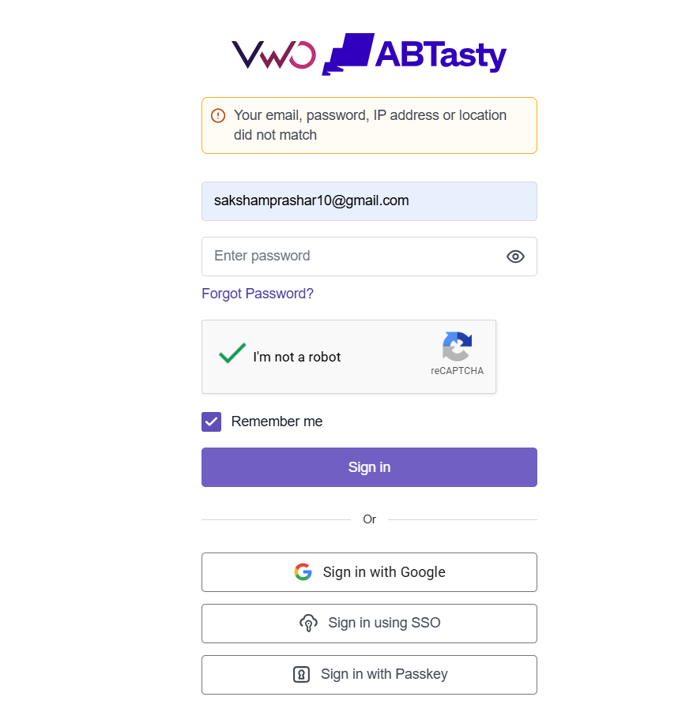

# VWO Authentication & Login Verification (Live Portal Analysis)

## Project Overview
A rigorous black-box manual testing execution conducted on the live VWO enterprise login interface (`https://app.vwo.com/#/login`). The core objective was to stress-test authentication boundaries, UI layout performance, security constraints, and error-handling structures using standard QA design templates.

## Test Artifacts & Metrics
* **Complete Login Test Suite:** [Click here to view Login_Test_Cases_100.xlsx](./Test_Artifacts/Login_Test_Cases_100.xlsx)
* **Total Executed Cases:** 50 Test Cases covering functional validation matrix paths.
* **Testing Techniques Applied:** Equivalence Partitioning (EP), Boundary Value Analysis (BVA), Error Guessing, Negative String Injections, and Tab-Navigation flows.

## Captured Execution Proof
* Detailed validation checks showing explicit inline form boundary checks and application warning alignment mapping:

